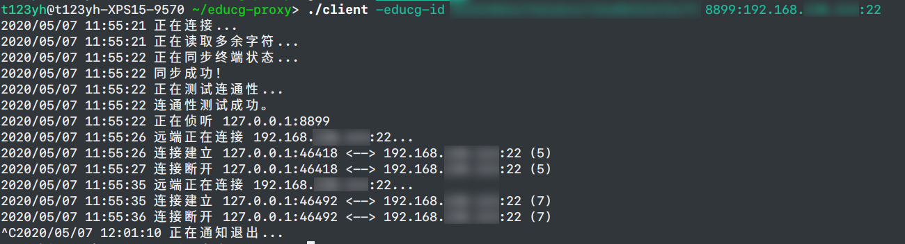

# OS Lab Proxy 
让你在本地愉快写 OS Lab，并直接在本地提交，无需登录服务器。

## 使用方法
1. 在 Release 页面下载 server 和 client 程序。
2. 在 Web 界面中将 server 文件上传到服务器。
3. 使用下面说明的参数在本地启动 client 程序。在启动程序之前，请先在浏览器中登录平台并进入 shell 界面（进入后即可关闭），否则可能无法连接。
4. 使用 `git remote` 命令将 git 上游地址改为你映射的本地地址。参考的上游地址格式为 `ssh://git@127.0.0.1:<本地端口>/18373xxx-lab`。
5. 将服务器上的 `~/.ssh/id_rsa` 复制到本地，并将其设置为仓库 git ssh 的私钥。
6. 将本地仓库的远端地址设为映射的地址，然后使用 git push 推送即可。

## 注意事项

* 程序使用时，不可操作 web 终端（可以查看），请勿在其中按键，否则会破坏程序状态导致其无法工作。
* 使用完后，请按 Ctrl+C 退出程序。退出程序时 server 会 panic，是正常现象。退出后刷新网页方可重新使用 web 终端。
* 如果没有正常退出程序，则可能无法正常在 web 界面中使用终端。此时请在 web 终端中按一下 Ctrl+C，然后输入 reset 并按 Enter（此时没有回显是正常现象，reset 过后会恢复正常），即可正常使用终端。

## client 程序参数
`./client -educg-id <在线实验系统 ID> [-bin <server 文件路径>] <映射 1> [<映射 2> ...]`

其中：
* `educg-id` 是你在线实验系统的 ID，例如如果在线实验系统的 URL 是 `http://course.educg.net:xxxx/aabbccdd11223344/terminals/1` ，那么 ID 就是 `aabbccdd11223344`。
* `server 文件路径` 是服务器上你的 server 文件存放位置。如果没有指定，则默认为 `/home/jovyan/server`。
* `映射 n` 是你自定义的映射规则，格式为 `<本地端口>:<远程 IP>:<远程端口>`。例如，如果希望在本地的 127.0.0.1:8899 端口访问远端服务器 `192.168.12.34` 的 22 端口，则可以写 `8899:192.168.12.34:22`。注意请根据仓库服务器的实际地址填写远程 IP，否则无法连接。git 使用 ssh 协议，远端端口号一般都是 22。

## 正常运行演示

